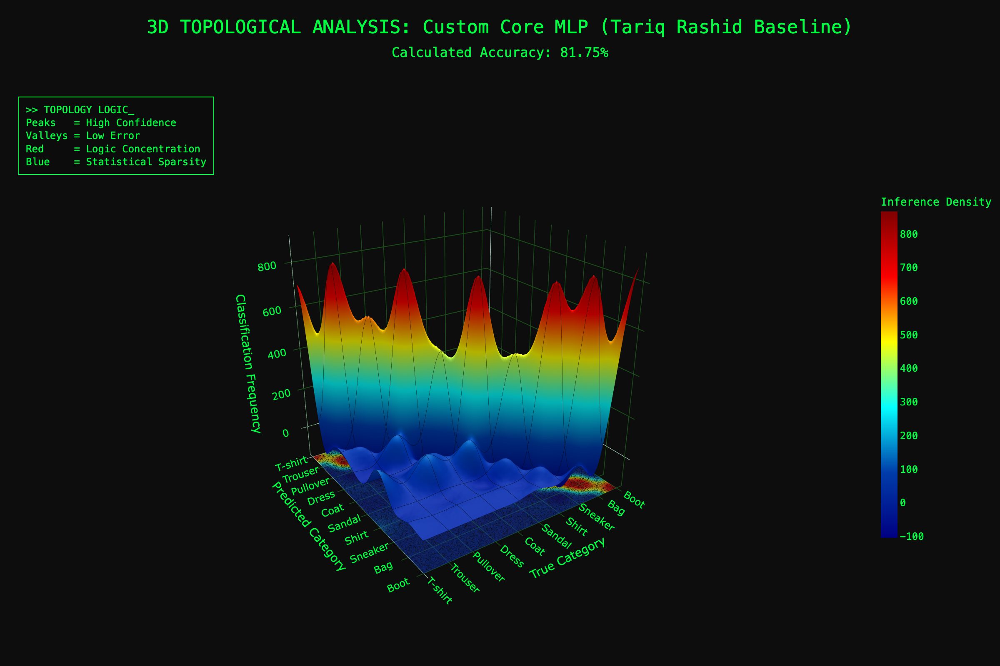
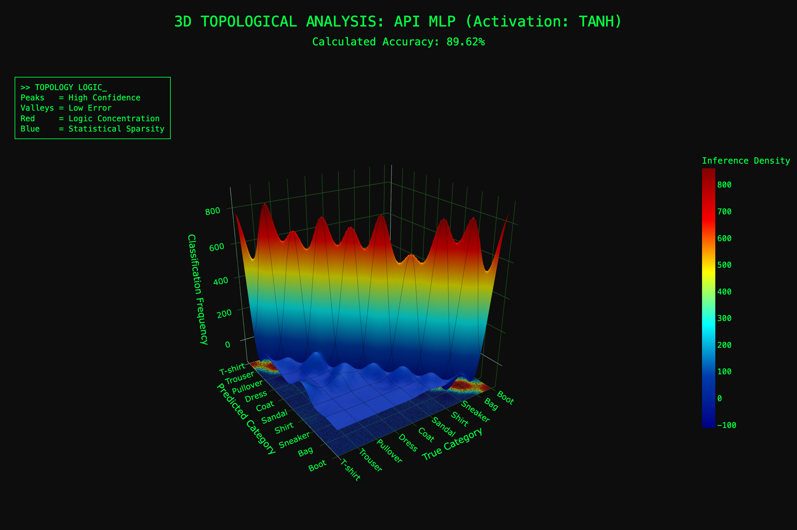

# 🧠 Neural Architecture Comparison: Manual Core vs. Optimized API
### *Fashion-MNIST Classification: A Deep Dive into Optimization and Topology*

---

## 📊 Performance Summary
This project demonstrates the impact of **Bayesian Hyperparameter Optimization** over a standard fixed-architecture neural network. By comparing a manual NumPy implementation with an Optuna-tuned Scikit-Learn pipeline, we observe a significant leap in both accuracy and classification clarity.

| Metric | Custom Core (Manual) | API + Optuna (Optimized) |
| :--- | :--- | :--- |
| **Accuracy** | 81.75% | **89.62%** |
| **Activation** | Sigmoid (Fixed) | **Tanh (Optimized)** |
| **Hidden Nodes** | 200 (Static) | **113 (Optimized)** |
| **Logic** | Baseline Math | Bayesian Intelligence |

---

## 🗺 3D Topological Analysis
To analyze the results, I transformed the **Confusion Matrix** into a 3D surface. This visualizes the **Inter-class Confusion** of the networks.

* **Sharp Diagonal Peaks:** Represent high precision and recall. In the API model, these peaks are significantly higher, indicating a more robust separation of feature manifolds.
* **Off-Diagonal Noise (The "Hills"):** These represent systematic misclassifications. In the Core model, these "hills" are more prominent between similar categories (e.g., T-shirt vs. Shirt).

> **🕹 Interactive Experience:** Click on the images below to open the interactive 3D landscapes in your browser.

| **Custom Core Implementation** | **Optimized API Pipeline** |
| :---: | :---: |
|  |  |
| *81.75% Accuracy. Note the broader "noise" in the valleys.* | *89.62% Accuracy. Note the sharper, more distinct peaks.* |

---

## 🔬 The Core vs. API Battle

### 1. Manual Core (Baseline)
* **Architecture:** 3-layer MLP based on Tariq Rashid's methodology.
* **Observation:** The model reached **81.75%**. While robust, the fixed sigmoid activation and manual learning rate limit its ability to capture complex textures.
* **Topology:** The 3D landscape shows broader **"error valleys"**, indicating more frequent confusion between similar categories (e.g., shirts vs. coats).

### 2. API + Optuna (Optimized)
* **Architecture:** Scikit-Learn `MLPClassifier`.
* **Strategy:** **Optuna** executed 10 trials using a TPE Sampler to find the mathematical "sweet spot".
* **Discovery:** It found that **113 nodes** and **Tanh** activation outperformed the larger 200-node baseline. This proves that "more neurons" doesn't always mean a "better model"—the right *balance* does.

---

## 🧪 Deep Dive: Why Tanh?

In this research, **Optuna** identified the **Hyperbolic Tangent (Tanh)** as the optimal activation function.

### Mathematical Foundation
$$\tanh(x) = \frac{e^x - e^{-x}}{e^x + e^{-x}}$$

### Key Advantages:
* **Zero-Centered Output:** Unlike Sigmoid (0 to 1), Tanh maps inputs to a (-1, 1) range. This ensures that the average activation is near zero, reducing "zig-zag" dynamics during gradient descent.
* **Gradient Strength:** Tanh provides stronger gradients near the origin compared to Sigmoid, helping the model learn faster in the early epochs.
* **Feature Mapping:** For image data, the ability to represent negative values helps the network capture contrast and textural differences more effectively.

---

## 🏁 Conclusion: Engineering Insights

This comparative study highlights a critical shift from **Manual Mathematical Implementation** to **Automated Bayesian Intelligence**. 

### 1. The HPO Advantage
The transition to an **Optuna-optimized 113-node model** proved that neural density is less important than mathematical alignment. The automated pipeline achieved a **+7.87%** accuracy boost while utilizing a more compact network.

### 2. Topology as a Diagnostic Tool
Beyond simple metrics, the **3D Topographical Analysis** revealed that proper hyperparameter tuning effectively "de-noises" the classification process, creating sharper **Decision Peaks** in the latent space.

### 3. Final Verdict
Modern API frameworks combined with HPO provide a more **scalable** and accurate path for complex recognition tasks. This project successfully bridges the gap between foundational ML theory and modern engineering practices.

---

## 📂 Project Setup
* **Core Engine:** `/core/custom_network.py`
* **API Pipeline:** `/api/sklearn_pipeline.py`
* **Visualization Engine:** `/visualizations/plotter.py`
* **Data Loader:** `/utils/data_loader.py`

---

## 👩‍💻 About the Author
**Developed by Dariia Zhdanova (@Dalliya)** | *ML Explorer & Architect of 3D Neural Topology Landscapes.*

> "In this study, I transitioned from manual mathematical foundations to automated Bayesian optimization, proving that even a 7.87% increase in accuracy is a journey of thousands of hidden neural connections."